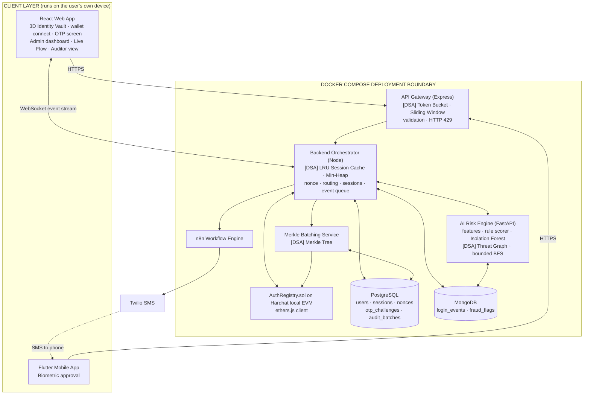
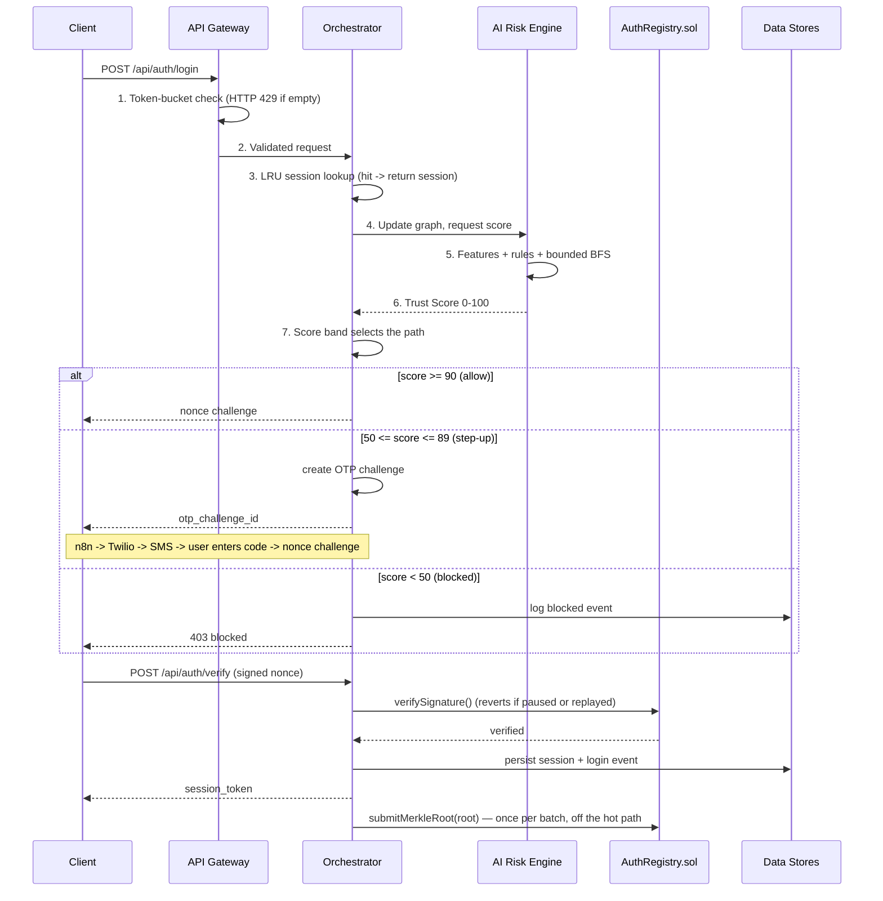

# Technical Requirements Document (TRD)

## AI-Augmented Decentralized Authentication System for Fraud-Resistant Banking Login Security

| Field | Detail |
|---|---|
| Document | Technical Requirements Document (TRD) |
| Version | 2.0 (Development Blueprint) |
| Status | Planning complete — **development not started** |
| Companion document | `PRD.md` — Product Requirements Document (defines *what* and *why*; this document defines *how*) |
| Source documents | `Review_1_Final_Year_Project_Document.pdf` + Banking/Fintech domain specialization note |
| Team | Karthik R Nair (20231CSE0041) · Sunny Singh (20231CSE0095) · Abhinand Baiju Smitha (20231CSE0146) |

**Source markers** used throughout: **[PDF]** = stated in the Review 1 document · **[DOMAIN]** = stated in the banking specialization note · **[DECISION]** = a technical choice made here because neither source specified it (reason always given).

**Status labels**: **IMPLEMENTED** (built — currently zero items) · **REQUIRED** (to be built this term) · **FUTURE** (out of scope).

---

## 1. Technical Overview

### 1.1 What is being built, technically

A **layered, service-oriented system** made of six runnable pieces plus two clients:

| Piece | Language / runtime | Job in one line |
|---|---|---|
| API Gateway | Node.js + Express | Rate-limit and validate every request before it costs anything |
| Backend Orchestrator | Node.js + Express | Run the login state machine: nonce → score → route → verify → session → audit |
| AI Risk Engine | Python + FastAPI | Turn a login's context into a Trust Score 0–100, including graph proximity |
| Smart Contract | Solidity on a local Hardhat chain | Registration, signature verification, Merkle root anchoring, pause |
| Automation Engine | n8n | Fire the OTP workflow and the admin alert |
| Data stores | PostgreSQL + MongoDB | Structured profile/session data · high-volume behavioural telemetry |
| Web client | React + Three.js | Customer login screens, admin dashboard, live flow view, auditor view |
| Mobile client | Flutter | Biometric approval of a pending web login |

**[PDF]**

### 1.2 The one technical idea that shapes everything

**No secret is ever transmitted.** The private key is generated and kept inside the browser wallet extension or the phone's secure enclave. The backend only ever sees a *public* wallet address and a *signature over a challenge it issued*. Every other design decision (why there is no password table, why replay protection lives in the contract, why sessions are short-lived) follows from this.

### 1.3 The second technical idea: score before you challenge

Risk scoring happens **before** the signature challenge is issued. That is what makes friction adaptive rather than uniform. It also means the risk engine sits on the hot path of every login, which is why every hot-path operation in the design is O(1) and why the graph search is bounded to three hops. **[PDF]**

### 1.4 Non-functional budget the design must respect

| Budget | Value | Where it constrains the design |
|---|---|---|
| End-to-end high-trust login | < 2 s (NFR-01) | Rules-based scoring, bounded BFS, one contract call |
| Rate-limiter overhead | < 5 ms (NFR-03) | In-memory token bucket, no database call |
| Session validation | O(1) (NFR-02) | LRU cache in front of the sessions table |
| Dashboard update | < 3 s (NFR-04) | Push over WebSocket, not polling |
| Circuit breaker trip | < 10 s (NFR-11) | Sliding-window counter evaluated on every attempt |

---

## 2. Technology Stack

### 2.1 Fixed by the source documents **[PDF]**

These are named in the Review 1 document and are **not** open to re-selection:

| Layer | Technology |
|---|---|
| Web frontend | React, Three.js |
| Mobile | Flutter |
| Gateway / Orchestrator | Node.js, Express.js |
| AI service | Python, FastAPI |
| Blockchain | Solidity, Hardhat (local EVM), ethers.js, OpenZeppelin ECDSA |
| Automation | n8n |
| SMS | Twilio |
| Relational store | Supabase (PostgreSQL) |
| Document store | MongoDB |
| Deployment | Docker Compose |

### 2.2 Versions and supporting libraries **[DECISION]**

Chosen for stability, popularity and how easy they are to learn — not for novelty. Pin exact versions in each `package.json` / `requirements.txt` at the start of development and do not upgrade mid-term.

| Area | Choice | Why this choice |
|---|---|---|
| Node runtime | **Node.js 20 LTS** | Long-term support through the project period; native `fetch`, stable ESM |
| Node language | **TypeScript 5** | Catches shape mismatches across three services written by three different people — the single highest-value safety net for a small team |
| Package manager | **npm** | Ships with Node; every tutorial assumes it; no extra install. One lockfile per service, never two |
| Web build tool | **Vite 5** | Instant dev server and near-zero config. Next.js is rejected: this app is a wallet-gated SPA with no SEO or server-rendering need, so SSR would be complexity with no payoff |
| React | **React 18** | Stable, matches every current tutorial and library |
| Styling | **Tailwind CSS 3** + a small set of **shadcn/ui** components | Consistent spacing and typography without hand-building a design system; shadcn components are copied into the repo so there is no runtime dependency to manage |
| 3D graph | **`react-force-graph-3d`** (wraps Three.js + `d3-force-3d`) | Gives a working 3D force-directed graph in ~30 lines instead of writing a physics simulation. Three.js remains the underlying renderer, as the source requires |
| Animation | **Framer Motion** | Named in the domain note; declarative, respects `prefers-reduced-motion` |
| Wallet / chain client | **ethers.js v6** | Named in the source; v6 is the current major line; used identically in the browser and on the server |
| Realtime | **Socket.IO 4** | Automatic reconnection and rooms out of the box; raw `ws` would mean writing reconnection logic by hand |
| Python | **Python 3.11**, **FastAPI**, **Pydantic v2**, **Uvicorn** | FastAPI validates request bodies from the type hints and generates OpenAPI docs for free |
| ML | **scikit-learn** (`IsolationForest`), **NumPy** | The canonical implementation of the algorithm the source selected |
| Postgres access | **`pg`** driver + plain `.sql` migration files | An ORM (Prisma/TypeORM) is rejected: the schema is five small tables, and writing the SQL directly is simpler to debug and better for a CSE viva |
| MongoDB access | **`mongodb`** (Node), **`pymongo`** (Python) | Official drivers; no ODM needed for two collections |
| Solidity | **0.8.24**, **Hardhat 2.x**, **OpenZeppelin Contracts 5** | 0.8.x has built-in overflow checks; OpenZeppelin's `ECDSA` is the audited library the source requires |
| Logging | **pino** (Node), stdlib `logging` (Python), JSON lines | Structured logs that Docker captures cleanly |
| Testing | **Vitest** + **Supertest** (Node), **pytest** (Python), **Hardhat + Chai** (contracts), **Playwright** (one E2E path, *Should*) | Vitest shares Vite's config, so there is one build setup, not two |
| Containers | **Docker Compose v2** | Named in the source; one file, one command |

### 2.3 Deliberately rejected

| Rejected | Reason |
|---|---|
| Next.js / SSR | No SEO or server-rendering requirement; adds a server the project does not need |
| Kubernetes | Massively over-engineered for a single-node academic demo |
| Kafka / RabbitMQ | The event queue is an in-process array flushed to the Merkle batcher; a broker would add an unjustified service |
| Redis | The LRU cache and token bucket are **the point of the project** (DSA showcase). Replacing them with Redis would delete the contribution |
| An ORM | Five tables; plain SQL is clearer and better for the viva |
| GraphQL | A fixed, small set of endpoints; REST is simpler |
| Firebase Cloud Messaging | Requires internet + a Google project; conflicts with the offline-demo constraint (see §5.7) |

---

## 3. System Architecture

### 3.1 Architectural style **[PDF]**

Layered and service-oriented. The client layer talks to the backend over HTTPS and WebSocket. The orchestrator coordinates **three peer services** — the AI risk engine, the blockchain client, and the automation layer — none of which calls the others. Two databases are used for their respective strengths.

Two properties are design decisions, not accidents:

1. **Scoring is isolated behind a service boundary**, so the rule-based scorer can be replaced by a trained model without touching the orchestrator or the API contract (FR-13).
2. **No horizontally scalable service holds unrecoverable in-memory state.** The LRU cache, token buckets and threat graph can all be rebuilt from the shared data stores (NFR-12).

### 3.2 Eight layers **[PDF]**

| Layer | Responsibility |
|---|---|
| Client Layer | React web app (3D vault UI, wallet connect) and Flutter mobile app (biometric approval) |
| API Gateway | Express gateway performing token-bucket rate limiting and request validation |
| Backend Orchestrator | Node service coordinating the session cache, AI calls, blockchain calls and event queueing |
| AI Risk Engine | Python/FastAPI service computing the Trust Score and running graph-based fraud analysis |
| Blockchain Layer | Solidity contract handling registration, signature verification, Merkle root anchoring and pause |
| Automation Layer | n8n workflows triggering Twilio SMS OTPs and administrator alerts |
| Data Layer | PostgreSQL (structured profile data) and MongoDB (unstructured telemetry and fraud logs) |
| Visualization Layer | React + Three.js live 3D threat graph and administrator dashboard |

### 3.3 Architecture diagram



`[DSA]` marks each point where a classical data structure is applied (see §8). The client applications sit **outside** the Docker boundary because they run on the user's own device. **[PDF]**

### 3.4 Thirteen components **[PDF]**

| # | Component | Purpose (why it exists) | Talks to |
|---|---|---|---|
| C1 | React Web Application | Browser-resident client so the private key stays in the wallet extension and is never sent to a server | Gateway (HTTPS/WS), browser wallet |
| C2 | Flutter Mobile Application | Lets the user approve a login with device biometrics instead of signing on the laptop | Gateway, device secure enclave |
| C3 | Express API Gateway | A single entry point where abusive traffic is rejected before it costs anything | Clients, Orchestrator |
| C4 | Node Orchestrator | One place where routing policy lives, rather than spread across services | Gateway, AI, Blockchain, Automation, both DBs, Visualization |
| C5 | FastAPI Risk Engine | Scoring isolated behind a service boundary so the backend is pluggable (FR-13) | Orchestrator, MongoDB |
| C6 | Threat Graph engine | Per-login scoring alone cannot see coordination between accounts (P5) | In-process within C5; MongoDB |
| C7 | n8n workflow engine | Keeps step-up and alerting policy editable without redeploying the orchestrator | Orchestrator, Twilio |
| C8 | Twilio | Delivers the second factor to the registered phone | n8n |
| C9 | Merkle Batching Service | Writing every event on-chain individually would be slow and costly | Orchestrator, contract, both DBs |
| C10 | PostgreSQL | Relational store for data with a fixed shape and referential integrity | Orchestrator |
| C11 | MongoDB | Document store for high-volume telemetry whose shape evolves with the feature set | Orchestrator, Risk Engine |
| C12 | AuthRegistry.sol + Hardhat chain | Ledger-enforced registration, verification, anchoring and pause | Orchestrator, Merkle batcher |
| C13 | Visualization Layer | Makes risk legible spatially, so an operator sees a cluster instead of reading a log | Orchestrator (event stream) |

### 3.5 Gateway and orchestrator: one container or two? **[DECISION]**

**Decision: two containers, as the source specifies.** The gateway stays deliberately thin — rate limiting, body validation, and a proxy to the orchestrator, roughly 150 lines. Keeping it separate preserves the architectural story that matters at viva ("the attack is refused *before* anything expensive happens") and matches Figure 1 in the Review 1 document.

**Documented fallback:** if integration time runs short in Phase 8, the gateway can be collapsed into the orchestrator as an Express middleware chain without changing any API path or any requirement. The rate-limit code is written as standalone middleware precisely so this move stays cheap.

---

## 4. Frontend

### 4.1 Application structure

A single React SPA with route-based code splitting.

| Route | Screen | Audience | Requirements |
|---|---|---|---|
| `/` | **Identity Vault** landing — 3D animated lock that reacts to wallet connection | Customer | FR-01 |
| `/login` | Signature prompt — one action, nothing else on screen | Customer | FR-05, FR-06 |
| `/otp` | Six-digit OTP step-up screen | Customer | FR-11, FR-21 |
| `/admin` | Dashboard shell with tabs | Analyst | FR-23 |
| `/admin/graph` | **Threat Graph** tab — live 3D force-directed graph, colour-coded clusters | Analyst | FR-16, FR-23 |
| `/admin/flow` | **Live Authentication Flow** tab — animated step-by-step login | Analyst / evaluator | FR-28 |
| `/admin/attempts` | Top-N riskiest attempts, rank ordered | Analyst | FR-24 |
| `/admin/audit` | **Audit Proof Verification** — pick an event, verify its Merkle proof in the browser | Auditor | FR-18, FR-29 |
| `/admin/control` | Circuit-breaker pause / resume control | Analyst | FR-19 |

### 4.2 Web technology detail **[DECISION]**

| Concern | Choice | Reason |
|---|---|---|
| Routing | React Router 6 | Standard, no framework needed |
| Server state | TanStack Query | Handles loading/error/retry for every API call so components stay simple |
| Client state | React Context + `useReducer` | The app has little global state (wallet, session, socket). Redux would be overkill |
| Wallet | `window.ethereum` via ethers.js `BrowserProvider`; MetaMask as the reference wallet | The de-facto standard browser wallet; EIP-1193 means other wallets work too |
| Signing | `personal_sign` / EIP-191 (`signer.signMessage`) | Matches OpenZeppelin's `toEthSignedMessageHash` on the contract side exactly — no custom hashing |
| Device fingerprint | SHA-256 (Web Crypto API) over user-agent, language, timezone offset, screen resolution, colour depth, platform | No third-party tracking library, no network call, easy to explain and audit. Acknowledged as a *weak* fingerprint — see §18 |
| Realtime | Socket.IO client, one connection, two channels: `threat-graph` and `auth-flow` | One socket, two rooms — simpler than two connections |
| Merkle verification | Recomputed **in the browser** with `ethers.keccak256` | This is the whole point of FR-29: the auditor must not have to trust the server's arithmetic |

### 4.3 The Live Authentication Flow screen (FR-28) **[DOMAIN]**

The orchestrator already emits a live event stream over WebSocket. The only backend change needed is to emit **step-by-step events during the login**, not just a final result.

| Step event emitted | What the screen shows |
|---|---|
| `wallet_connected` | Icon lights up: "Device connected" |
| `nonce_issued` | The challenge appearing |
| `signing` | Animated lock: "Signing with private key on device…" |
| `scoring_started` / `scoring_factor` / `scoring_done` | A number counting from 0 up to the final Trust Score, with contributing factors popping in ("Device: familiar ✓", "Location: unusual ⚠") |
| `routing_decision` | Visually branches into one of three paths — green allow, yellow OTP, red blocked |
| `chain_verifying` / `chain_verified` | Transaction sent, then confirmed |
| `session_created` | Checkmark: "Login complete in X.XX seconds" |
| `audit_queued` | Event animating into the Merkle tree |

Implemented as a Framer Motion timeline driven by the socket. **No new technology is introduced** — React and WebSocket are already in the architecture.

### 4.4 Frontend quality bar **[DECISION]**

- Semantic HTML; every interactive element reachable by keyboard with a visible focus ring.
- `prefers-reduced-motion` respected — the 3D graph stops animating and the flow screen renders steps without transitions.
- Responsive down to 375 px; the 3D graph falls back to a 2D list view on small screens.
- One consistent set of design tokens (colours, spacing, radii) defined once in the Tailwind config.
- **NFR-07:** the words *nonce*, *Merkle*, *BFS*, *hash* never appear on `/`, `/login` or `/otp`.

### 4.5 Risk colour language (NFR-08)

| Band | Colour | Meaning |
|---|---|---|
| 90–100 | Green | Allowed directly |
| 50–89 | Amber | Step-up required |
| 0–49 | Red | Blocked |
| Flagged cluster | Distinct purple outline | Part of a detected fraud ring |

Colour is never the only signal — each state also carries an icon and a text label, so the dashboard stays readable for colour-blind users.

---

## 5. Backend

### 5.1 API Gateway service

| Aspect | Detail |
|---|---|
| Runtime | Node 20, Express 4, TypeScript |
| Responsibilities | Token-bucket rate limiting per source IP · sliding-window burst smoothing · request body validation (`zod`) · proxy to the orchestrator |
| Rejects with | `HTTP 429` when the bucket is empty; `HTTP 400` on a malformed body |
| Ordering rule | **Rate limiting runs first**, before validation, before any downstream call (SR-09) |
| Config **[DECISION]** | Token bucket: capacity **10**, refill **1 token / 3 s** (≈ 20 requests/minute per IP) on `/api/auth/*`. Sliding window: **30 requests / 60 s**. Values chosen to let a real person retry a login comfortably while making a scripted flood fail almost immediately; both configurable by environment variable |

### 5.2 Backend Orchestrator service

The orchestrator owns the login state machine. Its responsibilities **[PDF]**: nonce issue and expiry, LRU session lookup, risk-based routing, session creation, event queueing, and graceful degradation when the risk engine is unreachable.

**Login state machine:**

```
IDLE
 └─ POST /api/auth/login (wallet, deviceFingerprint)
      ├─ session in LRU cache and not expired ──────────────► SESSION_ACTIVE (return existing session)
      └─ no session
           └─ update threat graph, request Trust Score
                ├─ score >= 90 ─────────► CHALLENGE_ISSUED (nonce returned)
                ├─ 50 <= score <= 89 ──► OTP_PENDING (otp_challenge_id returned)
                └─ score < 50 ─────────► BLOCKED (event logged, nothing else returned)

OTP_PENDING
 └─ POST /api/auth/otp/verify (otp_challenge_id, code)
      ├─ correct and not expired ──────► CHALLENGE_ISSUED (nonce returned)
      └─ wrong / expired / 3 attempts used ──► BLOCKED

CHALLENGE_ISSUED
 └─ POST /api/auth/verify (wallet, nonce, signature)
      ├─ contract verifySignature() succeeds ──► SESSION_ACTIVE (token issued, event queued for audit)
      └─ invalid / replayed / contract paused ──► BLOCKED
```

**Graceful degradation (NFR-10) [PDF]:** if the risk engine call fails or times out (**timeout: 800 ms [DECISION]** — leaves ~1.2 s of the 2 s budget), the orchestrator assigns the attempt to the **medium band** and routes it through OTP. It never fails open.

### 5.3 AI Risk Engine service

See §9 for the scoring logic. Technically: FastAPI, one scoring endpoint, Pydantic request/response models, threat graph held in memory and rebuilt at startup from MongoDB.

### 5.4 Merkle Batching Service **[DECISION on parameters]**

Runs as a module inside the orchestrator container (a separate container would add a service for a ~200-line job).

| Parameter | Value | Reason |
|---|---|---|
| Flush trigger | **16 queued events OR 60 seconds elapsed**, whichever comes first | 16 gives a clean 4-level tree for the demo; 60 s means a demo never waits long for an anchor |
| Hash function | `keccak256` (via ethers.js) | Matches Ethereum's native hash, so browser, backend and contract all agree with no conversion |
| Leaf | `keccak256(canonicalJson({eventId, wallet, ip, deviceFingerprint, trustScore, decision, timestamp}))` | Field order is fixed and documented so the auditor can recompute it exactly |
| Odd node rule | If a level has an odd number of nodes, the **last node is promoted unchanged** to the next level (not duplicated) | Duplicating a node enables a known second-preimage confusion; promotion is simpler and safe here. **The rule must be identical in the batcher and in the browser verifier** |
| On flush | Build tree → `submitMerkleRoot(root)` → store `batch_id`, `root`, `tx_hash` in `audit_batches` → write `batch_id` + `leaf_hash` + `leaf_index` back onto each event document |

### 5.5 Automation layer (n8n) **[DECISION on the split]**

**Security-sensitive work stays in code we test; n8n does delivery and policy.**

| Responsibility | Where it lives | Why |
|---|---|---|
| Generate the 6-digit OTP, store its hash, enforce TTL and attempt limit, verify it | **Orchestrator** | This is a security control and must be unit-tested. Putting OTP verification in a visual workflow makes it untestable |
| Receive the medium-band webhook, call Twilio, log the execution, dispatch admin alerts | **n8n** | This is exactly the "editable without redeploying the orchestrator" role the source describes |

**Workflow 1 — OTP step-up:** Webhook (`wallet`, `phone`, `otp_challenge_id`, `code`, `band`) → HTTP Request to Twilio → respond 200.
**Workflow 2 — Admin alert:** Webhook (`reason`, `count`, `window`) → log + notification channel.

**OTP parameters [DECISION]:** 6 digits, **5-minute** TTL, **3** attempts, then the challenge is destroyed and the attempt becomes `blocked`. Only a hash of the code is stored, never the code itself.

### 5.6 Blockchain client

`ethers.js v6` `JsonRpcProvider` pointed at the Hardhat container. A single server-side signer (the admin account) submits `submitMerkleRoot`, `pauseAuth` and `resumeAuth`. `verifySignature` is called as a transaction so that nonce consumption is recorded on-chain (that is what makes FR-07 ledger-enforced rather than policy-enforced).

### 5.7 Mobile companion backend contract **[DECISION]**

**Decision: the mobile app polls for pending approvals every 3 seconds instead of receiving a push notification.**

**Reason:** push notifications need Firebase Cloud Messaging, which needs a Google Cloud project, an internet connection and platform credentials. That directly conflicts with NFR-09 (the whole demo must run offline from one `docker compose up`) and adds setup work with no marks attached. A 3-second poll is a dozen lines of Dart, works offline on the same LAN, and looks identical in the demo. Push is recorded as **FE-07** in the PRD.

Endpoints: `GET /api/mobile/pending/:wallet` and `POST /api/mobile/approve`.

---

## 6. APIs

### 6.1 Conventions **[DECISION]**

- JSON request and response bodies; `Content-Type: application/json`.
- Success → `2xx` with the payload. Failure → the error envelope in §14.2.
- Authenticated endpoints take `Authorization: Bearer <session_token>`.
- Admin endpoints additionally require the session's wallet to equal the configured admin wallet.
- Every response carries an `X-Request-Id` header for log correlation.

### 6.2 Endpoint catalogue

Thirteen endpoints come from the source **[PDF]**; four are added **[DECISION]** and marked.

| # | Method | Endpoint | Auth | Description |
|---|---|---|---|---|
| 1 | POST | `/api/auth/register` | none | Register a wallet on-chain and create its off-chain profile |
| 2 | POST | `/api/auth/nonce` | none | Issue a fresh single-use nonce for a wallet |
| 3 | POST | `/api/auth/login` | none | **Start** a login attempt: score it and return the routing decision |
| 4 | POST | `/api/auth/verify` | none | **[DECISION]** Submit the signed nonce; verify on-chain; create the session |
| 5 | POST | `/api/auth/otp/verify` | none | Verify a submitted OTP code on the medium-risk path |
| 6 | POST | `/api/auth/logout` | session | Invalidate the current session |
| 7 | GET | `/api/risk/score/:wallet` | session | Most recent Trust Score for a wallet |
| 8 | GET | `/api/graph/threat` | admin | Current threat graph nodes and edges for visualization |
| 9 | GET | `/api/graph/cluster/:id` | admin | Details of a specific flagged fraud cluster |
| 10 | GET | `/api/audit/proof/:eventId` | admin | Merkle proof (leaf + sibling path) for a login event |
| 11 | GET | `/api/audit/root/:batchId` | admin | On-chain Merkle root for a batch |
| 12 | POST | `/api/admin/pause` | admin | Call the contract's `pauseAuth()` |
| 13 | POST | `/api/admin/resume` | admin | Call the contract's `resumeAuth()` |
| 14 | GET | `/api/admin/attempts/top` | admin | Top-N riskiest recent attempts (min-heap) |
| 15 | GET | `/api/mobile/pending/:wallet` | session | **[DECISION]** Pending login approvals for the mobile app |
| 16 | POST | `/api/mobile/approve` | session | **[DECISION]** Submit a biometric-signed nonce from mobile |
| 17 | GET | `/api/health` | none | **[DECISION]** Liveness/readiness for Docker Compose |

### 6.3 Why login is two calls, not one **[DECISION — resolving a source conflict]**

The Review 1 document describes `/api/auth/login` in Table 5.4 as *"submits a signed nonce; triggers risk scoring"*, but Figures 2 and 3 and §4.3 all state that **the risk score is computed before the signature challenge is issued**. Those cannot both be true in one request.

**Decision: follow the figures — two calls.**
- `POST /api/auth/login` starts the attempt and returns the routing decision (and a nonce, if the attempt may proceed).
- `POST /api/auth/verify` submits the signature and returns the session token.

The response fields the source specifies (`decision`, `trust_score`, `session_token` on allow, `otp_challenge_id` on OTP) are preserved — `session_token` simply arrives on the second call, which is the only call that can produce it. Recorded as gap item **G-02** (§21).

### 6.4 Request / response shapes

**`POST /api/auth/register`**
```jsonc
// request
{ "wallet_address": "0x…", "display_name": "Asha R", "phone_number": "+91…" }
// 201
{ "wallet_address": "0x…", "registered": true, "tx_hash": "0x…" }
// 409 — wallet already registered (FR-04)
```

**`POST /api/auth/login`**
```jsonc
// request
{ "wallet_address": "0x…", "device_fingerprint": "a3f1…" }

// 200 — allow path (score >= 90)
{ "decision": "allow", "trust_score": 96, "nonce": "8f2c…", "challenge_id": "…", "expires_at": "…" }

// 200 — step-up path (50–89)
{ "decision": "otp_required", "trust_score": 71, "otp_challenge_id": "…",
  "factors": [ { "name": "device", "status": "unfamiliar", "penalty": 30 } ] }

// 403 — blocked (< 50)
{ "decision": "blocked", "trust_score": 22, "reason": "risk_threshold" }
```

**`POST /api/auth/verify`**
```jsonc
// request
{ "wallet_address": "0x…", "nonce": "8f2c…", "signature": "0x…" }
// 200
{ "decision": "allow", "trust_score": 96, "session_token": "…", "expires_at": "…" }
// 401 invalid signature · 409 replayed nonce · 503 authentication paused (FR-19)
```

**`GET /api/audit/proof/:eventId`**
```jsonc
{ "event_id": "…", "batch_id": 7, "leaf_index": 2, "leaf_hash": "0x…",
  "siblings": [ { "hash": "0x…", "position": "right" }, { "hash": "0x…", "position": "left" } ] }
```

**`GET /api/admin/attempts/top?n=10`**
```jsonc
{ "attempts": [ { "event_id": "…", "wallet_address": "0x…", "trust_score": 12,
                  "decision": "blocked", "cluster_id": "c-004", "timestamp": "…" } ] }
```

### 6.5 WebSocket events (Socket.IO)

| Room | Event | Payload | Consumer |
|---|---|---|---|
| `threat-graph` | `graph:update` | added/updated nodes and edges, cluster flags | Threat Graph tab (FR-23) |
| `threat-graph` | `attempt:new` | one ranked attempt | Top-N list (FR-24) |
| `auth-flow` | `flow:step` | `{ challenge_id, step, data, t_ms }` | Live Flow screen (FR-28) |
| `system` | `system:paused` / `system:resumed` | reason, actor | Whole dashboard (FR-19) |

---

## 7. Database

### 7.1 Why two databases **[PDF]**

| Store | Holds | Why this store |
|---|---|---|
| PostgreSQL | Profiles, sessions, nonces, OTP challenges, audit batches | Fixed shape, referential integrity, transactional correctness matters |
| MongoDB | Login events, fraud cluster flags | High volume, schema evolves as features are added, no joins needed |

### 7.2 Supabase vs a plain PostgreSQL container **[DECISION]**

**Decision: run `postgres:16-alpine` in Docker Compose as the primary store, with a schema written to be Supabase-compatible (plain SQL, no Supabase-only features).**

**Reason:** NFR-09 requires the whole demo to run offline from one command. Supabase's hosted service needs the internet, and running Supabase's full local stack pulls in a dozen extra containers the project does not use. A plain Postgres container is one service, boots in two seconds, and speaks identical SQL. If the team later wants Supabase's hosted dashboard, the same migration files apply unchanged — only `DATABASE_URL` changes. The source's naming ("Supabase (PostgreSQL)") is respected because it *is* PostgreSQL.

### 7.3 PostgreSQL schema

Tables 1–3 come from the source **[PDF]**; tables 4–6 are additions required by features the source specifies **[DECISION]**.

```sql
-- 1. users [PDF] (+ phone_number, needed by FR-21)
CREATE TABLE users (
  id              uuid PRIMARY KEY DEFAULT gen_random_uuid(),
  wallet_address  text UNIQUE NOT NULL,
  display_name    text,
  phone_number    text,                      -- required for SMS OTP; never on-chain, never logged
  is_admin        boolean NOT NULL DEFAULT false,
  created_at      timestamptz NOT NULL DEFAULT now(),
  last_login_at   timestamptz
);

-- 2. sessions [PDF]
CREATE TABLE sessions (
  id            uuid PRIMARY KEY DEFAULT gen_random_uuid(),
  user_id       uuid NOT NULL REFERENCES users(id) ON DELETE CASCADE,
  token_hash    text UNIQUE NOT NULL,        -- SHA-256 of the session token; the token itself is never stored
  trust_score   integer NOT NULL CHECK (trust_score BETWEEN 0 AND 100),
  issued_at     timestamptz NOT NULL DEFAULT now(),
  expires_at    timestamptz NOT NULL,
  revoked_at    timestamptz
);
CREATE INDEX ON sessions (token_hash);
CREATE INDEX ON sessions (user_id, expires_at);

-- 3. nonces [PDF]
CREATE TABLE nonces (
  id              uuid PRIMARY KEY DEFAULT gen_random_uuid(),
  wallet_address  text NOT NULL,
  nonce_value     text NOT NULL,
  used            boolean NOT NULL DEFAULT false,
  expires_at      timestamptz NOT NULL,
  created_at      timestamptz NOT NULL DEFAULT now(),
  UNIQUE (wallet_address, nonce_value)
);
CREATE INDEX ON nonces (expires_at);

-- 4. otp_challenges [DECISION] - required by FR-11 / FR-21
CREATE TABLE otp_challenges (
  id              uuid PRIMARY KEY DEFAULT gen_random_uuid(),
  wallet_address  text NOT NULL,
  code_hash       text NOT NULL,             -- SHA-256 of the 6-digit code; the code is never stored
  attempts        integer NOT NULL DEFAULT 0,
  verified        boolean NOT NULL DEFAULT false,
  expires_at      timestamptz NOT NULL,
  created_at      timestamptz NOT NULL DEFAULT now()
);

-- 5. audit_batches [DECISION] - required by FR-17 / FR-18
CREATE TABLE audit_batches (
  batch_id      bigserial PRIMARY KEY,
  merkle_root   text NOT NULL,
  tx_hash       text,
  event_count   integer NOT NULL,
  submitted_at  timestamptz NOT NULL DEFAULT now()
);

-- 6. pending_approvals [DECISION] - required by FR-26
CREATE TABLE pending_approvals (
  id              uuid PRIMARY KEY DEFAULT gen_random_uuid(),
  wallet_address  text NOT NULL,
  nonce_value     text NOT NULL,
  context         jsonb NOT NULL,            -- device, region, time, trust band shown on the phone
  status          text NOT NULL DEFAULT 'pending',  -- pending | approved | expired
  expires_at      timestamptz NOT NULL,
  created_at      timestamptz NOT NULL DEFAULT now()
);
```

### 7.4 MongoDB collections **[PDF]** (with fields added for audit linkage)

```jsonc
// login_events
{
  "_id": "ObjectId",
  "event_id": "uuid",                 // stable id used by /api/audit/proof/:eventId
  "wallet_address": "0x…",
  "ip_address": "203.0.113.9",
  "device_fingerprint": "a3f1…",
  "trust_score": 96,
  "decision": "allow",                // allow | otp_required | blocked
  "factors": [ { "name": "device", "penalty": 0 } ],   // [DECISION] explains the score
  "timestamp": "2026-09-08T10:22:31Z",
  "batch_id": 7,                      // [DECISION] set when the event is anchored
  "leaf_hash": "0x…",
  "leaf_index": 2
}

// fraud_flags
{
  "_id": "ObjectId",
  "cluster_id": "c-004",
  "node_ids": ["0xwallet…", "203.0.113.9", "a3f1…"],   // wallets, IPs, devices
  "reason": "shared_device_across_wallets",
  "detected_at": "2026-09-08T10:20:00Z"
}
```

Indexes **[DECISION]**: `login_events` on `{event_id: 1}` (unique), `{wallet_address: 1, timestamp: -1}` (history lookups for scoring), `{timestamp: -1}` (dashboard), `{batch_id: 1}`. `fraud_flags` on `{cluster_id: 1}` and `{node_ids: 1}`.

### 7.5 On-chain state **[PDF]**

| Item | Content |
|---|---|
| `merkleRoots` | Append-only array of batch roots, one entry per submitted audit batch |
| `isRegistered` | Mapping from wallet address to registration status, enforcing one registration per wallet |
| `usedNonces` | Mapping recording consumed nonces per wallet (this is what makes FR-07 ledger-enforced) |
| `paused` / `admin` | Global circuit-breaker flag and the address authorised to set it |

**No personally identifiable information is written on-chain** (SR-14).

### 7.6 Threat graph storage **[DECISION]**

The graph is held **in memory** in the risk engine as an adjacency list, and rebuilt at startup by replaying the last N days of `login_events` from MongoDB (default N = 7). Flagged clusters are persisted in `fraud_flags`.

**Reason:** the graph is a derived structure. Persisting it would create a second source of truth that could drift from the events. Rebuilding it satisfies NFR-12 (no unrecoverable in-memory state) and takes under a second at demo volumes.

### 7.7 Migrations **[DECISION]**

Plain numbered SQL files (`001_init.sql`, `002_otp.sql`, …) applied by a small startup script. No migration framework: six tables do not justify one, and the raw SQL is directly presentable at viva.

---

## 8. Data Structures and Algorithms

This is the CS core of the project. **Every structure is tied to a specific bottleneck, not chosen for decoration.** **[PDF]**

| Structure | Bottleneck it addresses | Why this structure | Time | Space | Lives in |
|---|---|---|---|---|---|
| **Token bucket** | Unauthenticated clients could flood the login endpoint | Rejects excess requests **before** any scoring or database access, so an attack is cheap to refuse and expensive to sustain | O(1) per check | O(1) per tracked IP | Gateway |
| **Sliding window counter** | A fixed-window counter mis-counts bursts at window boundaries | Smooths burst detection alongside the token bucket | O(1) amortised | O(w) for window size w | Gateway |
| **LRU cache** | Validating a session against the database on every request adds latency for active users | A hash map paired with a doubly linked list gives constant-time lookup *and* constant-time eviction of the least recently used entry — bounding memory while keeping hot sessions fast | O(1) average get/put | O(k) for capacity k | Orchestrator |
| **Graph + bounded BFS** | Per-login risk checks miss fraud spread across many apparently unrelated accounts | Modelling wallets, IPs and devices as nodes makes proximity to a known bad actor measurable; the **three-hop bound** keeps traversal inside the login latency budget | O(V + E) over the explored subgraph | O(V + E) | Risk Engine |
| **Merkle tree** | Writing every login event on-chain is slow and costly | Only the root is written; any single event is still provable, and tampering changes the root | O(n) build, O(log n) proof | O(n) tree, O(log n) proof | Merkle batcher |
| **Min-heap** | An administrator needs the riskiest attempts first, not a chronological log | Retrieves the top-N riskiest attempts without sorting all recent activity | O(log k) insert / extract | O(k) | Orchestrator |

### 8.1 Two consequences worth stating at viva **[PDF]**

1. **Merkle proof verification is logarithmic in batch size**, so even large batches stay cheap to verify independently.
2. **Every hot-path operation is constant time** — the rate-limit check and the session cache lookup. That is precisely why the security layers this design adds are not expected to cost meaningful latency compared with a conventional password check.

### 8.2 Implementation notes **[DECISION]**

| Structure | Note |
|---|---|
| Token bucket | `Map<ip, {tokens, lastRefillMs}>`, lazy refill computed on read (no timers). A periodic sweep evicts IPs idle for > 10 minutes to bound memory |
| LRU cache | Written by hand (hash map + doubly linked list). JavaScript's `Map` preserves insertion order and *could* fake an LRU, but writing the real structure is the point of O5 — and it is the more defensible viva answer |
| Min-heap | Written by hand as an array-backed binary heap. A **min**-heap of size N keeps the N *riskiest* attempts by holding the lowest Trust Scores: the root is the safest of the retained set, so a new attempt replaces it whenever its score is lower. This inversion is worth stating explicitly — it is the classic top-K idiom |
| Merkle tree | Written by hand (~80 lines). The build and the proof-check must be byte-identical between the Node batcher and the browser verifier; a shared test vector file pins this |
| BFS | Written by hand with an explicit queue and a `depth > 3` cut-off. Never recursive |

---

## 9. AI/ML Components

### 9.1 Two scorers, one interface **[PDF]**

| Scorer | Status | Role |
|---|---|---|
| **Rule-based weighted scorer** | REQUIRED (Must) | The reliable baseline that always ships. Transparent, explainable, no training data needed |
| **Isolation Forest (scikit-learn)** | REQUIRED (Should) | Unsupervised upgrade path. Chosen because it needs **no labelled fraud data**, has linear time complexity and low memory — a good match for a system where anomalous logins are rare and unlabelled |

Both sit behind the same FastAPI contract, so the backend can be swapped without touching the orchestrator (FR-13).

### 9.2 Feature set **[PDF]**

| Feature | How it is computed |
|---|---|
| Device fingerprint delta | Has this fingerprint been seen for this wallet in past successful logins? |
| IP / geolocation delta | Is this IP or region new for this wallet? |
| Time-of-day pattern | Is this hour outside the wallet's usual login hours? |
| Login velocity | How many attempts from this IP in the recent window? |
| Graph distance to a known bad actor | Bounded 3-hop BFS from this login's nodes to the nearest flagged node |

### 9.3 Rule-based scoring **[PDF]**

Start at **100** and subtract a penalty for each abnormal signal:

| Signal | Penalty |
|---|---|
| Unrecognised device | **−30** |
| Unrecognised IP or region | **−20** |
| Off-hours login relative to that user's history | **−10** |
| High login velocity from a single IP | **−25** |
| Short graph distance to a known bad actor | **−35** |

The relative magnitudes encode the design's judgement: **proximity to confirmed fraud and an unfamiliar device weigh most**, while an unusual login hour on its own is a mild anomaly that should not by itself impose friction.

### 9.4 How penalties combine **[DECISION — resolving the source's own open item]**

The Review 1 document explicitly records that it does not state how the score behaves when several penalties apply at once, and flags it as needing clarification before implementation.

**Decision: penalties are additive and the result is clamped to the range [0, 100].**

```python
score = 100
for signal in triggered_signals:
    score -= PENALTY[signal]
score = max(0, min(100, score))
```

**Why additive-and-clamp:**
- It is **explainable**. Every point deducted maps to one named factor, which is exactly what the Live Flow screen (FR-28) and the `factors` array in the API need to display.
- It is **testable**. Given a set of signals, the expected score is a single arithmetic fact, so unit tests are trivial and unambiguous.
- It **degrades correctly**. Three simultaneous problems land below 50 and are blocked; one problem alone lands in the step-up band. That matches the intent of the bands.

Worked examples (these become unit-test fixtures):

| Situation | Signals | Score | Band |
|---|---|---|---|
| Regular customer, usual device and place (S1) | none | 100 | allow |
| Customer on a new phone (S2) | device (−30) | 70 | otp_required |
| Customer travelling (S2) | IP/region (−20) | 80 | otp_required |
| New device at 3 a.m. (S2) | device (−30), time (−10) | 60 | otp_required |
| Stolen credentials, new device + new region + fast retries (S3) | −30, −20, −25 | 25 | blocked |
| Wallet one hop from a known mule account (S4) | graph (−35), device (−30) | 35 | blocked |
| Every signal triggered | −30 −20 −10 −25 −35 = −120 | clamped to 0 | blocked |

### 9.5 Graph-based fraud detection **[PDF]**

- **Model:** an adjacency list over three node types — wallet, IP address, device fingerprint.
- **Edges:** on every login attempt, add `wallet ↔ ip` and `wallet ↔ device`.
- **Query:** breadth-first search from the new login's nodes, **bounded to three hops**, returning the distance to the nearest node already flagged as a bad actor.
- **Why bounded:** the hop bound keeps the traversal cheap enough to run inside the login path, and confines the method to the local neighbourhood where the fraud-detection literature reports the signal is strongest.
- **Cluster output:** connected flagged nodes are grouped and written to `fraud_flags` with a `cluster_id`, which the dashboard colours as one ring (FR-16).

**Seeding bad actors [DECISION]:** a node becomes flagged when (a) an admin marks it from the dashboard, or (b) it is involved in **3 or more blocked attempts within 1 hour**. Rule (b) is what makes scenario S4 self-demonstrating rather than requiring manual setup.

### 9.6 Isolation Forest **[DECISION on training]**

| Aspect | Choice |
|---|---|
| Library | scikit-learn `IsolationForest`, `n_estimators=100`, `contamination=0.05` |
| Training data | **Synthetic**, generated by a script: a few hundred "normal" login vectors per demo user plus a small proportion of injected anomalies |
| Feature vector | The five features of §9.2, numerically encoded |
| Output mapping | `decision_function` → normalised to 0–100 so it is drop-in comparable with the rule score |
| Selection | Environment variable `SCORER=rules \| iforest`; **`rules` is the default** |
| Honesty | Because training data is synthetic, **no accuracy claim is made on real banking fraud** (PRD limitation L2). The model demonstrates the pluggable-backend architecture; the rules ship as the reliable path |

### 9.7 Geolocation **[DECISION]**

| Concern | Choice | Reason |
|---|---|---|
| IP → region | Offline **MaxMind GeoLite2-Country** database file mounted into the risk-engine container, read with `geoip2` | No network call, so it works in the offline demo; a single file |
| Demo IPs | A small `demo_geo_overrides.json` maps the private/loopback addresses used in the demo to fictional regions | Every demo login otherwise comes from `127.0.0.1`, which no geo database can resolve. Without this, scenario S2 ("customer travelling") cannot be demonstrated |
| Missing database | Region resolves to `unknown` and the **region penalty is not applied** | Fail-safe: a missing data file must not silently block real users |

---

## 10. Blockchain and Smart Contract

### 10.1 `AuthRegistry.sol` interface **[PDF]**

Solidity 0.8.x, OpenZeppelin `ECDSA`.

| Function | Access | Behaviour |
|---|---|---|
| `registerUser()` | Any address, once | Records the caller as registered; reverts on a second attempt from the same wallet |
| `verifySignature(wallet, nonce, sig)` | Any address | Recovers the signer from the Ethereum signed-message hash using OpenZeppelin's audited ECDSA library and requires it to equal `wallet`; rejects a nonce already consumed by that wallet; **reverts while paused** |
| `submitMerkleRoot(root)` | Admin only | Appends a batch root to the append-only roots array and emits the batch identifier |
| `getMerkleRoot(batchId)` | Any address (view) | Returns the anchored root for a historical batch so a proof can be checked independently |
| `pauseAuth()` / `resumeAuth()` | Admin only | Sets and clears the global circuit-breaker flag consulted before verification |
| `transferAdmin(newAdmin)` | Admin only | Transfers administrative control; rejects the zero address |

**Events emitted for off-chain consumption:** `UserRegistered`, `LoginVerified`, `MerkleRootSubmitted`, `AuthPaused`, `AuthResumed`.

### 10.2 Three contract design decisions worth defending at viva **[PDF]**

1. **Signature recovery uses OpenZeppelin's audited ECDSA library**, not a custom implementation — this removes the highest-risk category of cryptographic bug from the project.
2. **Nonce reuse is prevented per wallet at the contract level**, so FR-07 (replay rejection) is enforced *by the ledger*, not merely by backend policy. Even a fully compromised backend cannot replay a signature.
3. **All state-changing administrative functions are gated by a single `onlyAdmin` modifier**, keeping the privileged surface small enough to audit by reading it.

### 10.3 Local chain **[DECISION]**

Hardhat node in its own container, chain ID `31337`, deterministic accounts. Deployment script writes the deployed address to a shared volume file that the orchestrator reads at startup, so no address is hard-coded and no manual copy step is needed between `docker compose up` and a working demo.

---

## 11. Authentication

### 11.1 Registration (FR-01 – FR-04)

1. Client obtains the wallet address from the browser extension.
2. `POST /api/auth/register` → orchestrator calls `registerUser()`.
3. On success, insert the `users` row. If the wallet already exists on-chain or in the table → **409** with a clear message.

### 11.2 Challenge / response login (FR-05 – FR-07)

| Element | Specification **[DECISION on parameters]** |
|---|---|
| Nonce | 32 random bytes, hex encoded, generated with `crypto.randomBytes` |
| Nonce TTL | **5 minutes** — long enough for a user to read a wallet prompt, short enough to shrink the replay window |
| Single use | Marked `used` in Postgres **and** consumed on-chain by `verifySignature`. Two independent enforcement points |
| Message signed | An EIP-191 personal message containing a fixed prefix, the wallet address, the nonce and the expiry — so a signature cannot be repurposed for another context |
| Signature scheme | secp256k1 ECDSA via `personal_sign`; recovered on-chain with OpenZeppelin `ECDSA.recover` on `toEthSignedMessageHash` |

### 11.3 Sessions: opaque tokens, not JWTs **[DECISION]**

**Decision: a session is a 32-byte random opaque token. Its SHA-256 hash is stored in `sessions` and the token is cached in the LRU cache. JWTs are not used.**

**Reason — this is a deliberate, defensible choice:**
- **Revocation is a requirement.** The circuit breaker (FR-19) and logout (endpoint 6) must be able to invalidate sessions *immediately*. A stateless JWT stays valid until it expires; an opaque token can be revoked on the spot.
- **A JWT would make the LRU cache pointless.** The whole justification for the LRU cache (NFR-02, O5) is that session validation needs a fast server-side lookup. Self-validating tokens delete that bottleneck — and with it, one of the project's five DSA contributions.
- **Simpler to explain and to secure.** No signing-key rotation, no algorithm-confusion class of vulnerability.

| Parameter | Value |
|---|---|
| Token | 32 random bytes, hex |
| Storage | SHA-256 hash in `sessions`; plain token only in the LRU cache and in the client |
| TTL | **30 minutes** absolute |
| LRU capacity | **1000** entries (well above demo volume; the eviction path is still exercised by unit tests) |
| Validation order | LRU hit → return · LRU miss → Postgres lookup → repopulate cache · not found or expired → 401 |
| Transport | `Authorization: Bearer` header (not a cookie — the SPA and the Flutter app share one mechanism, and there is no CSRF surface) |

### 11.4 Admin authentication **[DECISION]**

**No separate admin login system.** An admin authenticates with exactly the same wallet signature flow; the orchestrator then checks that the session's wallet equals the configured `ADMIN_WALLET` (which is also the contract's `admin`). Adding a second credential system to a project whose thesis is "eliminate credential stores" would contradict the project itself.

### 11.5 Mobile biometric approval (FR-26)

1. Web login reaches `CHALLENGE_ISSUED`; the orchestrator writes a `pending_approvals` row with the attempt's context.
2. The Flutter app polls `GET /api/mobile/pending/:wallet` every 3 s and displays the pending request.
3. The user confirms with `local_auth` (fingerprint / face), which unlocks the key held in the platform keystore / secure enclave.
4. The app signs the nonce and calls `POST /api/mobile/approve`.
5. The orchestrator verifies the signature on-chain exactly as it would for the browser, creates the session, and pushes `flow:step` events so the web session completes.

---

## 12. Data Flow

### 12.1 Login sequence (all three paths)



**Two rejection points precede scoring**, and both are cheap: the empty token bucket (nothing has been computed), and a live LRU session hit (nothing needs re-scoring). **[PDF]**

### 12.2 Audit anchoring and proof verification (FR-17, FR-18, FR-29)

The audit path runs **alongside** the login path, never inside it.

```
Verified login events ──► in-memory queue
        │ (16 events or 60 s)
        ▼
   Build Merkle tree:  H1=h(E1) H2=h(E2) H3=h(E3) H4=h(E4)
                       H12=h(H1|H2)      H34=h(H3|H4)
                       Root=h(H12|H34)
        │
        └──► submitMerkleRoot(Root)   ← ONE on-chain write per batch

Verifying event E3 later:
  proof = [H4 (right), H12 (left)]
  verifier recomputes  h( H12 | h( h(E3) | H4 ) )  and compares with getMerkleRoot(batchId)
  match    → record authentic and unaltered
  mismatch → record has been altered   ← this is TC-07
```

Verification is **O(log n)** in batch size. Any alteration to E3 changes H3 and therefore the recomputed root, so tampering is cryptographically detectable. **[PDF]**

### 12.3 Circuit breaker sequence (FR-19, FR-22)

1. On every attempt, the orchestrator increments a **sliding-window counter of anomalous attempts** (score < 50).
2. **[DECISION]** Threshold: **more than 50 anomalous attempts in a 10-second rolling window** (matching TC-05), configurable by environment variable.
3. Crossing it → orchestrator calls `pauseAuth()`, target **within 10 seconds** (NFR-11).
4. While paused, every login is rejected at the verification step **regardless of Trust Score**.
5. An admin alert is dispatched through n8n; `system:paused` is broadcast to the dashboard.
6. Authentication resumes only when an administrator explicitly calls `resumeAuth()`.

### 12.4 Live flow event stream (FR-28)

Every state transition in §5.2 emits a `flow:step` event carrying the challenge id, the step name, a small payload and elapsed milliseconds. The screen is a pure consumer — it holds no logic of its own, which keeps the demo view honest: **it shows what actually happened, not a scripted animation.**

---

## 13. Security

### 13.1 Threat model → implementation mapping

| ID | Threat | Implementation |
|---|---|---|
| SR-01 | Credential database breach | No password/credential column exists anywhere in the schema. Verify by inspection of §7.3 |
| SR-02 | Signature replay | Nonce marked `used` in Postgres **and** consumed on-chain; contract reverts on reuse |
| SR-03 | Brute-force / bot flood | Token bucket + sliding window at the gateway, evaluated before validation and before any downstream call |
| SR-04 | Coordinated fraud ring | Bounded BFS distance feeds a −35 penalty into the score; clusters written to `fraud_flags` |
| SR-05 | Audit tampering | Merkle root anchored on-chain; proof verified in the browser against `getMerkleRoot()` |
| SR-06 | Session hijacking | 30-minute opaque tokens, hashed at rest, revocable, bound to a verified signature event |
| SR-07 | Mass automated attack | Contract-level circuit breaker; pause is checked inside `verifySignature` so no path bypasses it |
| SR-08 | Key theft from the server | **Structurally impossible** — no endpoint accepts, and no table stores, private key material |

### 13.2 Transport and network

| Control | Implementation **[DECISION]** |
|---|---|
| Transport | HTTPS in any deployed environment; HTTP is acceptable **only** on `localhost` for the local demo, and this is stated openly rather than glossed over |
| Inter-service traffic | Docker Compose internal network; only the gateway and the Hardhat RPC port are published to the host |
| CORS | Allow-list of exactly one origin (the web app), configured by environment variable. No wildcard |
| Security headers | `helmet` defaults on both Node services |
| Input validation | `zod` schemas at the gateway, Pydantic models in FastAPI. Every wallet address is checksum-validated before use |

### 13.3 Secret handling **[DECISION]**

- All secrets come from environment variables loaded from a **git-ignored `.env`**. A committed `.env.example` lists variable **names only**, with empty values.
- `.gitignore` must contain `.env`, `*.key`, `secrets/` **before the first commit**.
- No secret value is ever logged, printed, screenshotted, pasted into the report or shown in the demo video.
- Hardhat's well-known development accounts are used locally and must never be reused on any public network.
- Twilio credentials live only in n8n's credential store and in the local `.env`.

### 13.4 Privacy (SR-13 – SR-16) **[DOMAIN]**

| Control | Implementation |
|---|---|
| Data minimisation | Only wallet address, IP, device fingerprint, timestamp and derived behaviour are collected — all for risk scoring alone |
| Nothing sensitive on-chain | On-chain state is limited to registration status, consumed nonces and Merkle roots (§7.5) |
| Telemetry access | `login_events` and `fraud_flags` are readable only by backend services and admin endpoints; a customer sees only their own activity |
| Phone numbers | Stored in Postgres solely to deliver the OTP; never written on-chain, never logged, never returned by a non-admin endpoint |
| Retention **[DECISION]** | `login_events` older than 90 days are purged by a scheduled job; their Merkle roots remain on-chain, so historical anchoring survives the purge |
| Compliance posture | Alignment statement only (SR-16). **No certification is claimed and no formal assessment is performed** |

---

## 14. Error Handling

### 14.1 Principles **[DECISION]**

1. **Fail safe, never fail open.** Any uncertainty in the auth path increases friction; it never reduces it.
2. **The user sees a plain sentence; the log holds the detail.** Error messages never leak whether a wallet exists, what the Trust Score was, or which internal service failed.
3. **Every error carries a request id**, so a screenshot from a demo can be traced to a log line.

### 14.2 Error envelope

```jsonc
{ "error": { "code": "NONCE_EXPIRED",
             "message": "Your login request timed out. Please try again.",
             "request_id": "7f3a…" } }
```

### 14.3 Error catalogue

| HTTP | Code | When | User-facing message |
|---|---|---|---|
| 400 | `INVALID_REQUEST` | Body fails schema validation | "Something went wrong with that request." |
| 401 | `INVALID_SIGNATURE` | Recovered signer ≠ wallet | "We could not verify your signature." |
| 401 | `SESSION_INVALID` | Unknown / expired / revoked session | "Your session has ended. Please log in again." |
| 403 | `RISK_BLOCKED` | Trust Score < 50 | "We could not complete this login. Please contact support." |
| 404 | `NOT_REGISTERED` | Wallet not registered | "This wallet is not registered yet." |
| 409 | `ALREADY_REGISTERED` | Duplicate registration (FR-04) | "This wallet is already registered." |
| 409 | `NONCE_USED` | Replay detected (FR-07) | "This login request has already been used." |
| 410 | `NONCE_EXPIRED` | Past TTL | "Your login request timed out. Please try again." |
| 422 | `OTP_INVALID` | Wrong code | "That code is not correct." (attempts remaining shown) |
| 429 | `RATE_LIMITED` | Token bucket empty | "Too many attempts. Please wait a moment." |
| 502 | `CHAIN_UNAVAILABLE` | RPC unreachable | "We are having trouble completing your login." |
| 503 | `AUTH_PAUSED` | Circuit breaker engaged (FR-19) | "Logins are temporarily paused. Please try again shortly." |

### 14.4 Degradation matrix

| Failing dependency | Behaviour | Requirement |
|---|---|---|
| **AI Risk Engine** down or slow (> 800 ms) | Treat as **medium risk** → OTP step-up. Never allow silently | NFR-10 |
| **Blockchain RPC** down | Reject the login with `CHAIN_UNAVAILABLE`; queue Merkle batches for retry with exponential backoff | Fail-safe |
| **MongoDB** down | Login still proceeds (scoring uses degraded history); events buffer in memory and flush on recovery, with the gap logged | Availability over telemetry completeness |
| **PostgreSQL** down | Login cannot proceed — sessions and nonces are authoritative. Return `503` | Correctness over availability |
| **n8n / Twilio** down | OTP cannot be delivered → the attempt fails closed with a clear message. It is **never** auto-upgraded to `allow` | Fail-safe |
| **Contract paused** | Everything rejected with `AUTH_PAUSED`, regardless of score | FR-19 |

### 14.5 Retry policy **[DECISION]**

| Operation | Policy |
|---|---|
| Risk-engine call | No retry (the 800 ms budget is the whole allowance); fall through to medium band |
| Chain read (`getMerkleRoot`) | 3 attempts, 200 ms exponential backoff |
| `submitMerkleRoot` | 5 attempts with backoff; the batch stays queued until it succeeds and is never dropped |
| n8n webhook | 2 attempts; on failure the attempt fails closed |

---

## 15. Testing

### 15.1 Levels **[PDF]**

| Level | Coverage | Tools **[DECISION]** |
|---|---|---|
| Unit | Token bucket refill logic, LRU eviction order, min-heap ordering, Merkle construction and proof verification, scoring arithmetic, contract functions in isolation | Vitest, pytest, Hardhat + Chai |
| Integration | Login through orchestrator → AI engine → blockchain client; OTP webhook through n8n → Twilio (mocked) | Vitest + Supertest, `testcontainers` or a compose test profile |
| System / end-to-end | Full login across all three Trust Score paths against the running Docker Compose stack | Playwright (one scripted happy path) + a manual checklist |
| Security | Replay attacks, rate-limit bypass attempts, simulated credential-stuffing bursts | Scripted with `k6` or a plain Node script |
| Usability | Informal walkthrough with non-technical users to check the login and OTP flows feel fast and understandable | Manual, notes recorded in the report |

### 15.2 The seven defined test cases **[PDF]**

| ID | Test | Expected result | Verifies |
|---|---|---|---|
| **TC-01** | Submit a valid signature for a fresh nonce | Session created | FR-05, FR-06 |
| **TC-02** | Re-submit a previously used signature | Rejected as a replay | FR-07 |
| **TC-03** | Exceed the token-bucket limit from one IP | `HTTP 429` | SR-03, NFR-03 |
| **TC-04** | Log in from a brand-new device for an existing wallet | Score falls in the medium band; OTP requested | FR-11, §9.3 |
| **TC-05** | Simulate > 50 anomalous logins in 10 seconds | Circuit breaker trips within 10 s | FR-19, FR-22, NFR-11 |
| **TC-06** | Request a Merkle proof for a known past event | Proof verifies against the on-chain root | FR-17, FR-18, FR-29 |
| **TC-07** | Tamper with a stored event, then re-verify its proof | **Verification fails** — this is the case that proves tamper-detection actually works | FR-18, SR-05 |

### 15.3 Requirements traceability matrix

Every Must requirement maps to at least one verifying test, so no critical requirement ships unverified. **[PDF]**

| Req | Component | Verified by |
|---|---|---|
| FR-01 – FR-03 | Web client, Orchestrator, Contract | TC-01 (registration precondition) + unit tests on `registerUser()` |
| FR-04 | Contract, Orchestrator | Contract unit test: second `registerUser()` reverts |
| FR-05 | Orchestrator | TC-01; unit test on nonce TTL and single use |
| FR-06 | Contract | TC-01 |
| FR-07 | Contract | **TC-02** |
| FR-09 | Risk Engine | Unit tests on the §9.4 worked-example table |
| FR-10 | Orchestrator | System test: allow path |
| FR-11 | Orchestrator, n8n | **TC-04** |
| FR-12 | Orchestrator, MongoDB | System test: blocked path leaves an event |
| FR-13 | Risk Engine | Integration test run twice: `SCORER=rules` and `SCORER=iforest`, same API contract |
| FR-14, FR-15 | Threat Graph | Unit tests on BFS depth bound and distance correctness |
| FR-16 | Dashboard | Manual + component test on cluster colouring |
| FR-17 | Merkle batcher | **TC-06**; unit test on the odd-node rule |
| FR-18 | Merkle batcher, Contract | **TC-06** and **TC-07** |
| FR-19 | Contract, Orchestrator | **TC-05**; contract unit test that `verifySignature` reverts while paused |
| FR-20, FR-21 | n8n, Twilio | TC-04 with Twilio mocked; one manual live-SMS run |
| FR-22 | n8n | TC-05 |
| FR-23, FR-24 | Dashboard, Min-heap | Unit test on heap ordering; manual latency check against NFR-04 |
| FR-26 | Mobile, Orchestrator | Manual device test |
| FR-28 | Orchestrator, Web | Integration test asserting the full ordered sequence of `flow:step` events |
| FR-29 | Web, Orchestrator | **TC-06**, **TC-07** |
| NFR-01 | All | Timed measurement over 20 high-trust logins; median and p95 recorded |
| NFR-10 | Orchestrator | Integration test with the risk engine stopped → expect `otp_required` |

*FR-08, FR-25 and FR-27 are absent from this matrix by design — all three are **FUTURE** (Could-tier) items and are not deliverables this term. Every **Must** and **Should** requirement is covered above.*

### 15.4 Coverage target **[DECISION]**

**80% line coverage on the pure-logic modules** (token bucket, LRU, min-heap, Merkle, scorer, BFS) and **100% of contract functions** exercised by at least one Hardhat test. No coverage target is set for UI components — reviewer time is better spent on the logic that decides who gets in.

---

## 16. Deployment

### 16.1 Environments **[PDF]**

| Environment | Purpose |
|---|---|
| Local development | Hot reload per service; each developer runs only the services they are working on |
| Integration | Full stack under Docker Compose |
| Demonstration | That stack plus a local Hardhat chain, rehearsed end to end |
| Public testnet showcase | Optional, to demonstrate real network behaviour |

### 16.2 Docker Compose services **[DECISION]**

| Service | Image / build | Port (host) | Depends on |
|---|---|---|---|
| `postgres` | `postgres:16-alpine` | 5432 | — |
| `mongo` | `mongo:7` | 27017 | — |
| `hardhat` | build `./contracts` | 8545 | — |
| `contract-deploy` | build `./contracts`, runs once and exits | — | `hardhat` |
| `risk-engine` | build `./services/risk-engine` | — (internal) | `mongo` |
| `orchestrator` | build `./services/orchestrator` | — (internal) | `postgres`, `mongo`, `hardhat`, `contract-deploy` |
| `gateway` | build `./services/gateway` | 8080 | `orchestrator` |
| `n8n` | `n8nio/n8n` | 5678 | — |
| `web` | build `./apps/web` | 5173 | `gateway` |

**Only `gateway`, `web`, `n8n` and the two database ports are published to the host.** Everything else talks over the internal network (SR-10).

Health checks on every service, with `depends_on: condition: service_healthy`, so `docker compose up` produces a working system on the first try — which is exactly what NFR-09 demands on demo day.

### 16.3 Startup sequence

```
postgres + mongo + hardhat  →  contract-deploy (writes address to a shared volume)
   →  risk-engine  →  orchestrator (reads address, runs SQL migrations)  →  gateway  →  web
```

### 16.4 Configuration **[DECISION]**

One `.env` at the repo root, consumed by Compose. `.env.example` is committed with names only.

| Variable | Purpose |
|---|---|
| `DATABASE_URL`, `MONGO_URL` | Data stores |
| `RPC_URL`, `CHAIN_ID`, `CONTRACT_ADDRESS`, `ADMIN_WALLET` | Chain wiring |
| `ADMIN_PRIVATE_KEY` | Server signer for admin transactions (local dev key only) |
| `SCORER` | `rules` (default) or `iforest` |
| `RATE_LIMIT_CAPACITY`, `RATE_LIMIT_REFILL_MS` | Token bucket tuning |
| `TRUST_ALLOW_MIN` (90), `TRUST_BLOCK_MAX` (49) | Band thresholds |
| `BREAKER_THRESHOLD` (50), `BREAKER_WINDOW_MS` (10000) | Circuit breaker |
| `MERKLE_BATCH_SIZE` (16), `MERKLE_BATCH_MS` (60000) | Anchoring cadence |
| `N8N_WEBHOOK_URL`, `TWILIO_*` | Automation (values only in the local `.env`) |

### 16.5 Demonstration readiness **[DOMAIN]**

| Item | Requirement |
|---|---|
| Seed script | `npm run seed` creates demo customers, a familiar-device history, and a pre-planted mule-account ring so scenarios S1–S4 are reproducible on demand |
| Scenario scripts | One script per scenario (S1–S6) so the demo does not depend on live typing |
| **Backup video** | A full recorded run of all six scenarios, produced **before** the final review. The live demo depends on a local chain and a Docker stack; a recorded fallback is required, not optional |
| Reset | `docker compose down -v && docker compose up` returns to a clean known state in under two minutes |

### 16.6 CI **[DECISION — optional, Should]**

A single GitHub Actions workflow running the three unit-test suites on every push. No deployment pipeline: there is no server to deploy to, and building one would be effort spent outside the marking scheme.

---

## 17. Project Structure

```
banking-auth-system/
├── docker-compose.yml
├── .env.example                     # names only, never values
├── .gitignore                       # .env, *.key, node_modules, __pycache__
├── README.md                        # setup in under 10 commands
├── docs/
│   ├── PRD.md
│   ├── TRD.md
│   └── diagrams/
├── contracts/                       # OWNER: Karthik
│   ├── contracts/AuthRegistry.sol
│   ├── scripts/deploy.ts
│   ├── test/authRegistry.test.ts
│   ├── hardhat.config.ts
│   └── package.json
├── services/
│   ├── gateway/                     # OWNER: Sunny
│   │   ├── src/index.ts
│   │   ├── src/middleware/tokenBucket.ts        [DSA]
│   │   ├── src/middleware/slidingWindow.ts      [DSA]
│   │   ├── src/middleware/validate.ts
│   │   └── test/
│   ├── orchestrator/                # OWNER: Sunny
│   │   ├── src/index.ts
│   │   ├── src/routes/{auth,admin,audit,graph,mobile}.ts
│   │   ├── src/core/loginStateMachine.ts
│   │   ├── src/ds/lruCache.ts                   [DSA]
│   │   ├── src/ds/minHeap.ts                    [DSA]
│   │   ├── src/audit/merkleTree.ts              [DSA]
│   │   ├── src/audit/batcher.ts
│   │   ├── src/chain/authRegistryClient.ts
│   │   ├── src/otp/{generate,verify}.ts
│   │   ├── src/realtime/socket.ts
│   │   ├── src/db/{postgres.ts,mongo.ts}
│   │   ├── migrations/00X_*.sql
│   │   └── test/
│   └── risk-engine/                 # OWNER: Abhinand
│       ├── app/main.py
│       ├── app/features.py
│       ├── app/scorers/{rules.py,iforest.py}
│       ├── app/graph/{threat_graph.py,bfs.py}   [DSA]
│       ├── app/geo.py
│       ├── data/demo_geo_overrides.json
│       ├── requirements.txt
│       └── tests/
├── apps/
│   ├── web/                         # OWNER: Karthik (3D/graph) + Sunny (flows)
│   │   ├── src/pages/{Vault,Login,Otp}.tsx
│   │   ├── src/pages/admin/{Dashboard,ThreatGraph,LiveFlow,Attempts,Audit,Control}.tsx
│   │   ├── src/lib/{wallet.ts,api.ts,socket.ts,fingerprint.ts,merkleVerify.ts}
│   │   └── package.json
│   └── mobile/                      # OWNER: Sunny
│       └── lib/{main.dart,pending.dart,biometric.dart,signer.dart}
├── automation/n8n/                  # OWNER: Sunny
│   └── workflows/{otp-stepup.json,admin-alert.json}
└── scripts/
    ├── seed.ts
    ├── scenarios/{s1..s6}.ts
    └── attack-sim.ts                # TC-05 / TC-03 load generator
```

**No monorepo tooling (npm workspaces, Nx, Turborepo) [DECISION].** Each service owns its own `package.json` and its own Dockerfile, and Compose builds them independently. Workspace tooling solves shared-dependency problems this project does not have, and adds a failure mode that is hard to debug two days before a review.

---

## 18. Technical Limitations

Honest technical boundaries, stated so no claim in this document is stronger than what it can support.

| # | Limitation | Detail |
|---|---|---|
| TL-01 | **Local chain only** | Hardhat, chain ID 31337, instant blocks and free gas. Real networks have block times, gas prices, reorgs and mempool latency. **No claim is made about production gas economics or confirmation latency** |
| TL-02 | **Single-node deployment** | Every service runs once, on one machine. The design keeps state reconstructible (NFR-12) so multi-instance running is *possible*, but it is not tested |
| TL-03 | **In-memory rate limiter and cache** | Token buckets, the LRU cache and the threat graph live in one process. Two gateway instances would each keep their own bucket, so the effective limit would double. Acceptable at demo scale; noted rather than hidden |
| TL-04 | **Weak device fingerprint** | A SHA-256 over browser attributes is stable enough to recognise a returning device, but it changes on a browser update and can be spoofed by a determined attacker. It contributes a *signal*, not proof of identity |
| TL-05 | **Synthetic training data** | The Isolation Forest is trained on generated data. It demonstrates the pluggable architecture; it does not demonstrate accuracy on real banking fraud |
| TL-06 | **Geolocation is approximate** | Country-level only, offline database, and demo IPs are resolved by an override file. Never treated as ground truth |
| TL-07 | **No contract audit** | Hardhat unit tests and a minimal privileged surface are the only assurance. No formal verification, no third-party audit |
| TL-08 | **`verifySignature` is a transaction, not a view** | Consuming the nonce on-chain is what makes replay protection ledger-enforced, but it means every login writes to the chain. On a real network this would cost gas per login; a production design would move nonce consumption off-chain and anchor it in the same Merkle batch. **This trade-off is deliberate and is worth raising before the panel does** |
| TL-09 | **OTP delivery depends on an external service** | Twilio needs the internet, so the one part of the demo that is not fully offline is SMS. A mock delivery mode (code shown in the dashboard) is provided as a fallback for offline rehearsal |
| TL-10 | **No account recovery** | Lose the device, lose the account (PRD limitation L4) |
| TL-11 | **Mobile approval polls, not pushes** | 3-second polling means up to a 3-second delay before a pending approval appears, and it wastes a request when nothing is pending |
| TL-12 | **No load testing at scale** | The attack simulator generates tens of requests per second, not thousands. Latency targets are measured on a laptop, not a load rig |

---

## 19. Future Improvements

| # | Improvement | What it would take |
|---|---|---|
| FI-01 | **WebAuthn / passkeys** as an alternative signing method (FE-01) | A second registration flow storing a credential public key; the verification path stays the same shape |
| FI-02 | **Zero-knowledge attribute proofs** (FE-02) | Prove "over 18" or "KYC-verified" without revealing the underlying data. A research project in its own right |
| FI-03 | **Move nonce consumption off-chain** (fixes TL-08) | Keep replay protection in the database, anchor consumed nonces in the same Merkle batch. Removes one chain write per login |
| FI-04 | **Redis-backed rate limiter and session cache** (fixes TL-03) | Would make the system multi-instance-correct. Deliberately *not* done here — the in-process structures are the project's DSA contribution |
| FI-05 | **Trained model on real, labelled data** | Requires a fraud dataset the project does not have. The pluggable interface is already in place |
| FI-06 | **Push notifications for mobile approval** (FE-07, fixes TL-11) | FCM / APNs integration |
| FI-07 | **Formal third-party contract audit** (FE-05) | Mandatory before any real deployment |
| FI-08 | **Public testnet showcase** (FE-06) | Deploy to Sepolia, fund with faucet ETH, point `RPC_URL` at it |
| FI-09 | **Attack Simulator panel in the UI** (FE-03) | The load script already exists; this is a UI wrapper over it |
| FI-10 | **Account recovery / guardian keys** (FE-09) | Social recovery or a threshold scheme; the genuine open problem in passwordless authentication |
| FI-11 | **Observability** | Structured metrics and a Grafana board; useful in production, not needed for a viva |

---

## 20. Key Technical Decisions — Summary

Every choice made in this document where the source materials were silent, with its one-line reason. **This table is the fastest revision sheet for the viva.**

| # | Decision | Reason |
|---|---|---|
| D-01 | TypeScript for all Node services | Catches cross-service shape errors in a three-person team |
| D-02 | Vite + React SPA, not Next.js | No SEO or SSR need; a server the project does not want |
| D-03 | Gateway and orchestrator as two containers | Preserves "rejected before scoring"; documented fallback to merge them |
| D-04 | Plain PostgreSQL container, Supabase-compatible SQL | The demo must run fully offline (NFR-09) |
| D-05 | Plain SQL migrations, no ORM | Six tables; raw SQL is clearer and better for the viva |
| D-06 | **Opaque session tokens, not JWTs** | Revocation is required (circuit breaker, logout), and a JWT would make the LRU cache pointless |
| D-07 | Two-call login (`/login` then `/verify`) | Resolves the source's own figure-vs-table conflict in favour of "score before challenge" |
| D-08 | Penalties additive, clamped to [0, 100] | Resolves the open item the source flags; explainable and directly testable |
| D-09 | OTP generation/verification in code, delivery in n8n | Security controls must be unit-testable; workflow policy stays editable |
| D-10 | Batch flush at 16 events or 60 s | Clean 4-level tree for the demo; no long waits |
| D-11 | keccak256 hashing; odd node promoted, not duplicated | One hash function across contract, backend and browser; avoids a known duplication pitfall |
| D-12 | Threat graph in memory, rebuilt from MongoDB | A derived structure should not become a second source of truth (NFR-12) |
| D-13 | Self-written LRU, min-heap, Merkle, BFS, token bucket | These *are* the contribution (objective O5) — a library would delete it |
| D-14 | Mobile polls every 3 s instead of push | FCM needs the internet and a cloud project; polling keeps the demo offline |
| D-15 | Admin auth = wallet signature + admin allow-list | A second credential system would contradict the project's own thesis |
| D-16 | Rules scorer is the default; Isolation Forest opt-in | The reliable path ships; the model is an upgrade, never a dependency |
| D-17 | Offline GeoLite2 + a demo override file | Geo must work offline, and `127.0.0.1` must be resolvable for scenario S2 |
| D-18 | 800 ms risk-engine timeout, then medium band | Fits the 2 s budget and satisfies fail-safe degradation (NFR-10) |
| D-19 | Test coverage on logic modules, not UI | Reviewer effort belongs where correctness decides who gets in |
| D-20 | No monorepo tooling | Solves a problem this project does not have; adds a failure mode before reviews |

---

## 21. Gap Analysis

Open questions, source conflicts and additions. **Items G-01 to G-05 need a decision from the team or the faculty coordinator; G-06 onward are recorded as resolved here** so development can start without waiting.

### 21.1 Open — needs confirmation

| ID | Gap | Why it matters | Suggested resolution | Owner |
|---|---|---|---|---|
| **G-01** | **The 16-week plan uses relative weeks (W1–W16) with no calendar start date**, while the departmental reviews are calendar dates (29 Aug, 12 Sep, 24 Oct, 28 Nov 2026). The two time bases have never been aligned. | Milestone M1 (end of W4) may or may not land before Review 2. Nobody can say whether the plan is on schedule until W1 is fixed. | Fix W1 against the calendar with the faculty coordinator at the next meeting, then redraw the Gantt chart with both time bases. | All + coordinator |
| **G-02** | **Login endpoint conflict.** Table 5.4 of the source says `/api/auth/login` "submits a signed nonce; triggers risk scoring", but Figures 2 and 3 and §4.3 say scoring happens *before* the challenge is issued. | These describe two different APIs. Building the wrong one wastes a week. | **Resolved in this TRD (§6.3): two calls, following the figures.** Confirm with the coordinator that the figures are authoritative. | Sunny |
| **G-03** | **Circuit breaker priority conflict.** §2.3.2 of the source lists it as a *stretch* objective; FR-19, the contract interface, the threat model, Figure 3, TC-05 and the success metrics all treat it as core. | If it were genuinely cut, five other parts of the specification would break. | **Resolved in this PRD/TRD: treated as Must.** Confirm. | Karthik |
| **G-04** | **The user data model has no phone number**, yet FR-21 requires SMS OTP delivery. | Without a phone number, the medium-risk path cannot be built at all. | **Resolved here:** `users.phone_number` added (§7.3), off-chain only, never logged. Confirm the privacy handling is acceptable. | Abhinand |
| **G-05** | **The source's Appendix A ("Source Consistency Notes") and Appendix B are listed in the table of contents at pages 43–45, but the supplied PDF ends at page 42.** Several sections point to Appendix A for unresolved items. | Some already-identified inconsistencies may be recorded there and unknown to this document. | Obtain the complete PDF, or the underlying `PRD-full-1.md`, and re-check this gap list against it. | All |

### 21.2 Resolved in this document — recorded for transparency

| ID | Gap in the source | Resolution here |
|---|---|---|
| G-06 | Score behaviour when multiple penalties apply is not stated (the source flags this itself) | Additive, clamped to [0, 100], with a worked-example table that doubles as unit-test fixtures (§9.4) |
| G-07 | Two different on-chain storage specifications exist in the source PRD (§13.3 vs §39) | The **implemented-contract version (§39)** is followed: `merkleRoots`, `isRegistered`, consumed nonces, `paused`/`admin` (§7.5) |
| G-08 | "Known bad actor" is used throughout but never defined | Defined: admin-flagged, or 3+ blocked attempts within 1 hour (§9.5) |
| G-09 | No table exists for OTP challenges, audit batches or pending mobile approvals | Three tables added (§7.3), each traced to the requirement that needs it |
| G-10 | Session token format, TTL and revocation are unspecified | Opaque 32-byte token, SHA-256 at rest, 30-minute TTL, revocable (§11.3) |
| G-11 | Nonce TTL is unspecified | 5 minutes (§11.2) |
| G-12 | Rate-limit numbers are unspecified | Capacity 10, refill 1/3 s, plus a 30/60 s sliding window (§5.1) |
| G-13 | Merkle batch size and cadence are unspecified | 16 events or 60 s; keccak256; odd node promoted (§5.4) |
| G-14 | Circuit-breaker threshold is implied by TC-05 but never stated as configuration | > 50 anomalous attempts in a 10 s rolling window, configurable (§12.3) |
| G-15 | How the device fingerprint is computed is unspecified | SHA-256 over six stable browser attributes, computed client-side, no third-party library (§4.2) |
| G-16 | Geolocation source is unspecified | Offline GeoLite2-Country + a demo override file, `unknown` on failure (§9.7) |
| G-17 | Admin authentication is unspecified | Wallet signature + `ADMIN_WALLET` allow-list; no second credential system (§11.4) |
| G-18 | Mobile "push notification" delivery is named but needs cloud infrastructure | 3-second polling instead, to preserve the offline demo; push recorded as FE-07 (§5.7) |
| G-19 | Failure behaviour for MongoDB, Postgres, chain and n8n is unspecified | Full degradation matrix (§14.4), all fail-safe |
| G-20 | Data retention is unspecified | `login_events` purged after 90 days; Merkle roots persist on-chain (§13.4) |
| G-21 | The Live Authentication Flow screen exists only as a domain-note idea | Specified as FR-28 with a defined `flow:step` event contract (§4.3, §12.4) |
| G-22 | The auditor-facing verification UI is described as a walkthrough but has no requirement ID | Specified as FR-29, verified by TC-06 and TC-07 (§6.2, §12.2) |

### 21.3 Consistency check between the PRD and this TRD

| Check | Result |
|---|---|
| Every PRD functional requirement (FR-01 – FR-29) has a named implementing component in this TRD | Pass |
| Every PRD non-functional requirement (NFR-01 – NFR-17) has a corresponding technical control | Pass |
| Every PRD security requirement (SR-01 – SR-19) appears in TRD §13 | Pass |
| Trust Score bands identical in both documents (≥ 90 / 50–89 / < 50) | Pass |
| Scoring penalties identical (−30 / −20 / −10 / −25 / −35) | Pass |
| Test cases TC-01 – TC-07 map to requirements in both documents | Pass |
| Technology stack in the TRD contains nothing the PRD does not imply | Pass |
| No feature is marked IMPLEMENTED anywhere | Pass — development has not started |
| Every **[DECISION]** carries a stated reason | Pass |
| No credential, key or token value appears in either document | Pass |

---

*End of TRD. Read alongside `PRD.md`. Open items G-01 to G-05 should be raised with the faculty coordinator before Phase 2 begins.*
